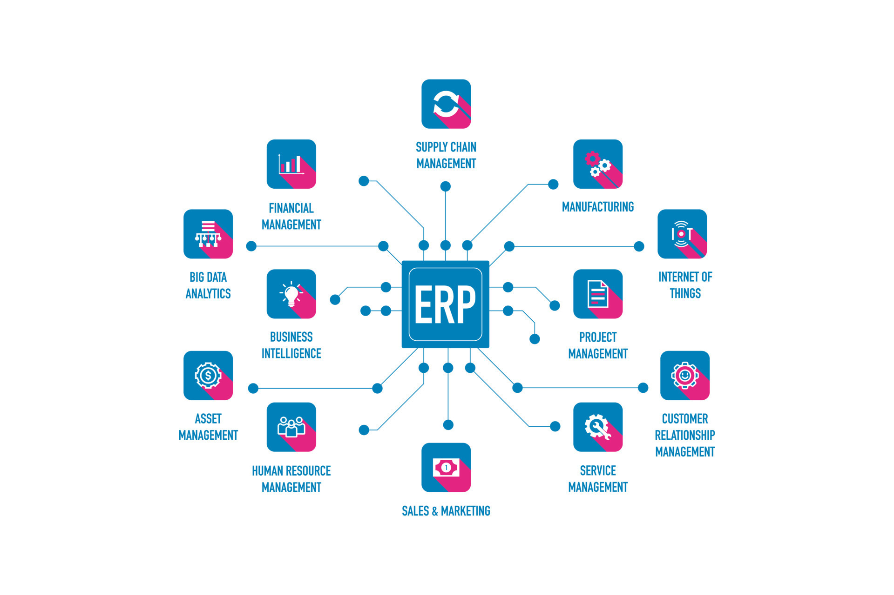

<div align="center">

# Skooly : Système d'Exploitation Universitaire


<br />

**L'infrastructure logicielle souveraine pour l'enseignement supérieur en Afrique.**

<br />

[](https://github.com/WistantKode/skooly/stargazers)
[](./LICENSE)
[](https://github.com/WistantKode/skooly/network/members)

<br />

[📖 Documentation](./docs/00-INDEX.md) · [⚡ Démarrage Rapide](#démarrage-rapide) · [🛠️ Guide Développeur](./docs/4-guides/DEV-JOURNEY.md)

<br />



<br />

## Atouts Stratégiques

Contrairement aux solutions génériques, Skooly est architecturé pour les réalités du terrain camerounais et de la zone CEMAC.

### 1. Moteur LMD Algorithmique
Automatisation stricte des délibérations selon les normes LMD : calcul des crédits, compensations inter-UE et gestion des dettes académiques.

### 2. Réconciliation Bancaire Native
Double intégration UBA (fichiers de flux) et Mobile Money (API). La banque est la seule source de vérité, éliminant toute tentative de fraude aux reçus.

### 3. Architecture Multi-Niveaux
Structure de Tenant hiérarchique permettant à une Université (ex: UD) de piloter plusieurs instituts (IUT, ENSET) avec une consolidation globale des données.

### 4. Résilience Offline (PWA)
Fonctionnement ininterrompu en zone blanche ou signal instable. Les données sont synchronisées automatiquement dès le retour du réseau.

### 5. Certification Numérique
Signature cryptographique et QR Code de vérification publique pour chaque relevé de notes et diplôme émis.

<br />

## Stack Technologique

| Composant | Technologie | Icône & Lien |
| :--- | :--- | :--- |
| **Backend** | NestJS | [](https://nestjs.com/) |
| **Frontend** | Next.js | [](https://nextjs.org/) |
| **Database** | PostgreSQL | [](https://www.postgresql.org/) |
| **ORM** | Prisma | [](https://www.prisma.io/) |
| **Styling** | TailwindCSS | [](https://tailwindcss.com/) |
| **Cache** | Redis | [](https://redis.io/) |

<br />

## Démarrage Rapide

### Pré-requis
Node.js v20+ · pnpm v9+ · Docker

### Installation
```bash
git clone https://github.com/WistantKode/skooly.git
cd skooly
pnpm install
pnpm dev
```

<br />

## Communauté et Maintenance

<a href="https://github.com/WistantKode/skooly/graphs/contributors">
  
</a>

<br />

**[WistantKode](https://github.com/WistantKode)**
*Lead Architect*

<br />

## Statistiques du Projet


<br />

© 2024 WistantKode. [Mentions Légales](./docs/1-concepts/06-compliance.md)

</div>
