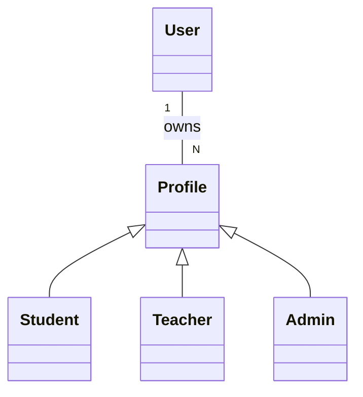

# 🧱 Module Core : Le Socle Invisible

## Description
Le module Core n'a pas de "valeur métier" directe, mais sans lui, rien n'existe.
C'est la copie carbone du module `base` d'Odoo.

## Entités Principales ("Models")

### 1. `User` vs `Partner` (Crucial)

Comme dans Odoo, on sépare strictement le **Compte de Connexion** du **Profil Métier**.

*   `User` (Table `users`) : Login, Password, 2FA, API Keys, Dernière IP.
*   `Partner` (Table `profiles`) : Nom, Prénom, Photo, Adresse, Email.

**Pourquoi ?**
Un `User` peut être **à la fois** Enseignant et Parent (ou Étudiant et Tuteur).
On lie 1 `User` à N `Profiles` (ou rôles).

### 2. Le Multi-Tenant ("Institution")

Chaque requête HTTP doit contenir le header `X-Institution-ID`.
Un middleware NestJS intercepte ce ID et l'injecte dans le contexte Prisma (`WHERE institution_id = X`).
**Isolation totale des données**.

## Sécurité & RBAC

On n'utilise pas de rôles "en dur" (pas de `if user.role == 'admin'`).
On utilise des **Capabilities** (CASL).

*   `can('read', 'Grade')`
*   `can('update', 'Attendance', { teacherId: user.id })`

## API Endpoints Clés

*   `POST /auth/login` : Retourne un JWT + Refresh Token.
*   `GET /auth/me` : Retourne l'utilisateur et ses profils actifs.
*   `POST /users/invite` : Envoie un lien magique pour rejoindre l'institution.
