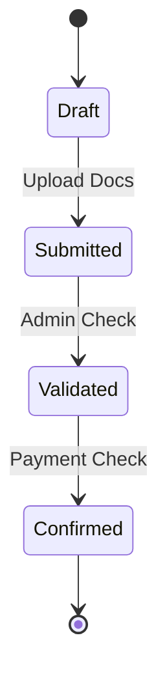

# 🎓 Module Academic : La Structure du Savoir

## Description
Ce module définit "ce qu'on apprend".
Il est conçu pour gérer la complexité du **LMD (Licence-Master-Doctorat)** camerounais.

## Entités Principales ("Models")

### 1. La Hiérarchie Structurelle
Contrairement à un lycée (Classe 6ème -> 5ème), l'université est une matrice.

1.  `Program` (Filière) : "Génie Informatique"
2.  `Level` (Niveau) : "Licence 3"
3.  `Semester` : "S5", "S6"
4.  `TeachingUnit` (UE) : "UE Programmation Web" (Conteneur de crédits)
5.  `CourseElement` (EC) : "EC React", "EC NestJS" (Matière réelle)

**Règle d'Or :** Les notes sont sur les EC, mais la validation est sur l'UE.

### 2. Le Cycle Académique

*   `AcademicYear` : 2024-2025.
*   `AcademicPeriod` : Semestre 1 (peut chevaucher 2 années civiles).

### 3. Inscriptions (`Enrollment`)

Une inscription n'est pas un booléen. C'est un **Workflow**.

1.  **Draft** : L'étudiant a cliqué "S'inscrire".
2.  **Submitted** : L'étudiant a uploadé ses documents (Bac, Acte naissance).
3.  **Validated** : L'administration scolaire a validé les pièces.
4.  **Confirmé** : La Finance a validé le paiement (Event `PaymentReceived`).

## Logique Métier

*   **Capitalisation** : Si un étudiant valide une UE en 2024 mais redouble, en 2025 cette UE reste "ACQUISE" (`validated_at`). Il ne la repasse pas.
*   **Dette** : Un étudiant peut passer en L2 avec une "dette" de 2 UE de L1. Le système doit tracker ces dettes.
